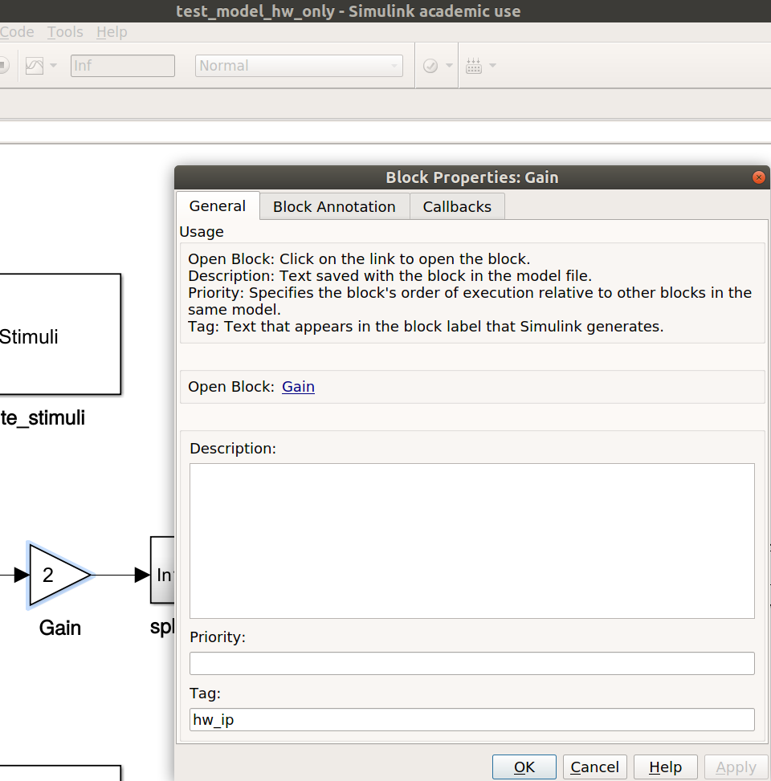

# MoDesA
MoDesA is an automated systematic design flow that couples model-based design and simulation with Xilinx Vivado High-Level-Synthesis (HLS) for hybrid hardware and software implementations and was presented on the [ReConFig18](http://www.reconfig.org/) conference. 
It makes use of the modeling and simulation environment MATLAB/Simulink. 
MoDesA is used for designing, simulating, prototyping, and testing different hardware/software solutions for Xilinx Zynq Programmable System-on-Chip (PSoC) architectures. 

Based on a tagging scheme, a manual partitioning of Simulink blocks onto resources is possible. 
Thereby, the proposed methodology allows to automatically explore different hardware and software implementation variants from a single behavioral Simulink model. 
The tool flow presents itself as a very powerful and user-friendly design tool for improving productivity. 
A more detailed description can be found in the paper [Model-Based Design Automation of Hardware/Software Co-Designs for Xilinx Zynq PSoCs](https://www.researchgate.net/publication/330728498_Model-Based_Design_Automation_of_HardwareSoftware_Co-Designs_for_Xilinx_Zynq_PSoCs)

## Usage
The user can specify a model in MATLAB/Simulink by interconnecting functional blocks from the Simulink library.
These blocks need to be tagged manually by the user with tags for code generation.
The following tags are currently supported in MoDesA:
  * `hw_ip`
  * `sw`

The blocks can be tagged by right click on the block -> Properties... and then entering in the field Tag: `hw_ip` or `sw`.
<p align="center">
 
</p>

Blocks with no tagging are ignored for code generation, which can be used for data sink or/and data source blocks.
For hardware/software tagged Simulink models, MoDesA will generate a Hardware/Software Co-Design like the one from [test_model_hw_sw_hw_sw](models/test_model/test_model_hw_sw_hw_sw.slx) with the Zynq and corresponding read and write adapters.

<p align="center">

</p>

In the [CMakeLists.txt](CMakeLists.txt) file the user specifies the following parameters:
  
  Variable  | Meaning
------------|----------------------------------------------------
`matlab`    | `on` or `off` use only MATLAB code generation
`synthesis` | `on` or `off` use also Vivado HLS and Vivado
`model_name`|  name of your Simulink model
`model_path`|  path of your Simulink model within [models](models)
`profiling` | `on` or `off` generates application graph from the model
`device`    |  target Zynq device e.g., `xc7z020clg484-1` (ZedBoard)
`clk`       |  target clock speed in ns e.g., `10`
`syn_opt`   | `fast` or `accurate` Vivado HLS synthesis option

The generated hardware IP blocks are using the AXI4-Stream interface for pipelined data streaming, which only supports sequential data access. 
Unfortunately, not all blocks within the Simulink library comply with these access patterns, and if this cannot be guaranteed, the synthesis will fail. 
To address this issue, we provide a Simulink block called frame_buffer. 
This block is available in our custom library [MoDesA_lib](matlab/MoDesA_lib.slx). In addition, to generate stimuli files for hardware verification the [MoDesA_lib](matlab/MoDesA_lib.slx) provides a write stimuli block, which can be inserted in the model.

### Prerequisites
* C/C++ Compiler like GCC on Linux or MSVC on Windows
* [CMake](https://cmake.org/) - Used to configure and create projects 
* [MATLAB/Simulink](https://mathworks.com/products/simulink.html) - Used for simulation and code generation
* [Xilinx Vivado HLS](https://www.xilinx.com/products/design-tools/vivado/integration/esl-design.html) - Used for High-Level Synthesis C/C++ -> HDL
* [Xilinx Vivado](https://www.xilinx.com/products/design-tools/vivado.html) - Used for HDL simulation and bitstream generation HDL -> FPGA

## Running the [test_model_hw_only](models/test_model/test_model_hw_only.slx) test
Before running the test, make sure all models in the [test_model](models/test_model) folder are exported/saved to your installed MATLAB version. 
If your current version is newer than R2017.a, (the provided test models were created from our side with MATLAB/Simulink R2017.a) you can just save the model with your installed version and delete the old .R2017a backup model file.
If your current version is older than R2017.a, send us a mail and we will export the test models to your version.

Next, make sure MATLAB, Vivado and Vivado HLS is set in your environment PATH variable and can be accessed from the command line.

### On Unix/Linux
Open a terminal and run:
```bash
# navigate to your MoDesA folder
cd ~/Desktop/MoDesA 
# create a build folder and enter
mkdir build && cd build
# configure project and start MATLAB code generation
cmake ..
```


If code generation was successful, you can generate IP blocks from the model by running:
```bash
# Create IP Blocks
make all
```


If IP block generation was successful, you can generate the Vivado project by running:
```bash
# Create Vivado Project
make Vivado_test_model_hw_only
```


### On Windows
All steps required for using MoDesA on Windows can be seen in the following video:

> Click Video: GUI Steps on Windows
[](https://youtu.be/3QI5QKn2B-8)

In Vivado a block design will be generated, which looks like the following:
<p align="center">
 
</p>
In your build folder you should find a report called *hw_objectives.html* with the estimated hardware resources and latency constraints derived by HLS for every block in the model.
<p align="center">
 
</p>
For a bit and cycle accurate simulation of the model start first a synthesis by clicking Run Synthesis in Vivado.
If synthesis is complete, you can click Run Simulation -> Run Post-Synthesis Functional Simulation.
Vivado will use the automatically generated testbench and stimuli files for simulation. The Simulation will display the expected result.
<p align="center">
 
</p>

## Currently Known Critical Simulink Blocks
Block                            | Reason
---------------------------------|----------------------------------------------------
Memory                           | `on` or `off` use MATLAB code generation
Unit Delay                       | `on` or `off` use Vivado HLS and Vivado
Estimate Geometric Transformation|  name of your Simulink model

## Authors
See the [AUTHORS](AUTHORS) file for details.

## ToDo
  * Add option for Chip soft-core processor generation.
  * Integrate SW profiling option on Windows and Linux.

## License

This project is licensed under the Apache License, Version 2.0 - see the [LICENSE.md](LICENSE.md) file for details.
